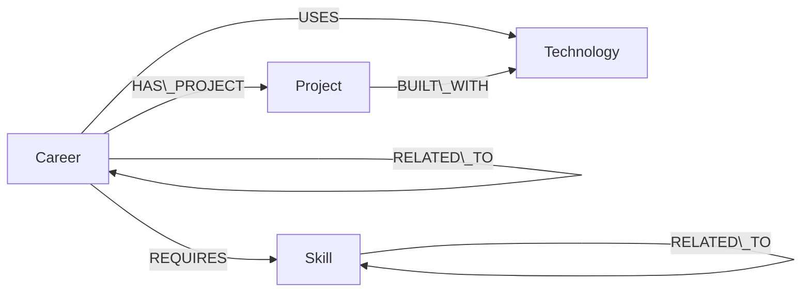

# SkillPath — Career Graph Explorer

SkillPath is a small graph-backed web application for exploring how **careers, skills, technologies and projects connect**. Instead of treating a career as an isolated record, the application lets a user follow relationships and discover adjacent career paths.

## Why a graph database?

The useful questions in SkillPath are relationship questions: *Which careers share skills with this one? Which skills are related to the skills I already have? Which technologies appear in projects connected to a career?* These questions naturally involve traversing several typed relationships.

A relational schema could represent the same facts, but the application would need increasingly complex joins or recursive queries as traversal depth and relationship types grow. In SkillPath, those connections are first-class graph edges and Cypher expresses the path directly.

## Architecture

* **React + TypeScript + Vite** — responsive web UI
* **Express + TypeScript** — small API layer and error boundary around the database
* **Neo4j JavaScript driver** — official Bolt client used to connect to CognoDB
* **CognoDB Cloud** — managed graph database running Cypher over Bolt

CognoDB documents that it supports Bolt 5.0–5.4, Cypher and the official Neo4j JavaScript driver, so no custom CognoDB SDK is required. See the official developer guide: https://cognodb.com/developers

## Graph model



Full model notes are in `docs/graph-model.md`.

## Main graph queries

### Multi-hop skill exploration

`Career -\[:REQUIRES]-> Skill -\[:RELATED\_TO]-> Skill`

This is used in the career drawer to expose second-degree skills rather than only listing direct requirements.

### Career recommendation

The recommendation query finds other careers that share required skills with the selected career, calculates the overlap, then ranks candidates by the percentage of their skills shared with the selected career. This is intentionally graph-oriented: the candidate set comes from shared `REQUIRES` edges.

### Cross-entity project traversal

`Career -\[:HAS\_PROJECT]-> Project -\[:BUILT\_WITH]-> Technology`

This demonstrates traversal across three entity types and connects abstract career information to concrete projects and tools.

All application queries use parameters through the official Neo4j driver; user input is never concatenated into Cypher.

## Project structure

```text
skillpath/
├── client/
│   ├── src/main.tsx
│   ├── src/styles.css
│   ├── index.html
│   └── vite.config.ts
├── cypher/queries.cypher
├── docs/graph-model.md
├── scripts/seed.ts
├── src/
│   ├── db.ts
│   ├── queries.ts
│   └── server.ts
├── .env.example
├── .gitignore
├── package.json
└── README.md
```

## Run locally

### 1\. Create a CognoDB instance

Create a free instance from the CognoDB Cloud console. CognoDB says the free tier requires no credit card and provides a `bolt+s://` connection URI. The password is displayed once, so store it securely.

### 2\. Configure secrets

Copy `.env.example` to `.env` and fill in your credentials:

```env
COGNODB\_URI=bolt+s://your-instance.databases.cognodb.com
COGNODB\_USERNAME=cognodb
COGNODB\_PASSWORD=your-password
PORT=3000
```

Never commit `.env`.

### 3\. Install and seed

```bash
npm install
npm run seed
```

The seed script is idempotent for the intended demo dataset by clearing the graph before loading it, which keeps local setup predictable.

### 4\. Start development

```bash
npm run dev
```

Open `http://localhost:5173`.

### 5\. Production build

```bash
npm run build
npm start
```

The Express server serves the built Vite client.

## Error handling

The API returns `503` responses when CognoDB is unreachable. The UI surfaces a clear error message rather than failing silently. Loading, empty-data and database-error states are handled explicitly.

## Seed data

The included seed data is intentionally small enough for CognoDB's free tier while being rich enough to demonstrate several relationship types. It contains careers across engineering, design, data and infrastructure, plus their skills, technologies and representative projects.

## Demo flow

1. Start on the career explorer.
2. Search for a skill such as **React**.
3. Open **Frontend Engineer**.
4. Show its direct skills and technologies.
5. Scroll to **Connected Skills · 2 Hops** and explain the `Career → Skill → Skill` traversal.
6. Show **You May Also Like** and explain that recommendations are calculated from shared graph relationships.
7. Open a related career to demonstrate that the graph is interactive rather than a static catalog.

## 

## \## Hosted Demo

## 

## \[SkillPath — Live Demo](https://skillpath-cognodb-peach.vercel.app/)

## 

## \## Screenshots

## 

## \### Main Career Explorer

## !\[SkillPath main page](docs/main%20page.png)

## 

## \### Career Details

## !\[Frontend Engineer career details](docs/screenshot-career.png)

## 

## \### Career Exploration

## !\[Career exploration](docs/screenshot-exploration.png)

## 

## 

## Submission checklist

* \[ ] Push the repository to GitHub.
* \[ ] Add the deployed application URL to this README.
* \[ ] Add 2–4 screenshots of the UI to this README.
* \[ ] Record the short demo using the flow above.
* \[ ] Keep the CognoDB instance running until the review is complete.
* \[ ] Email the GitHub repository URL and demo link to `hr@wexa.ai` with subject `CognoDB Assignment 2 – <Your Name>`.

