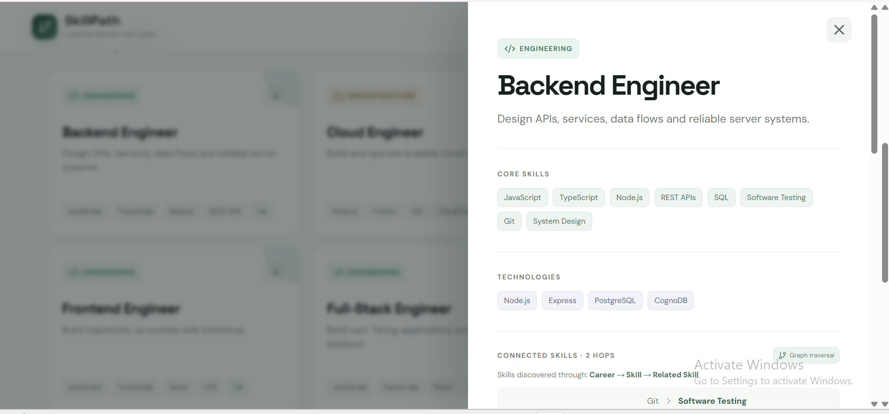
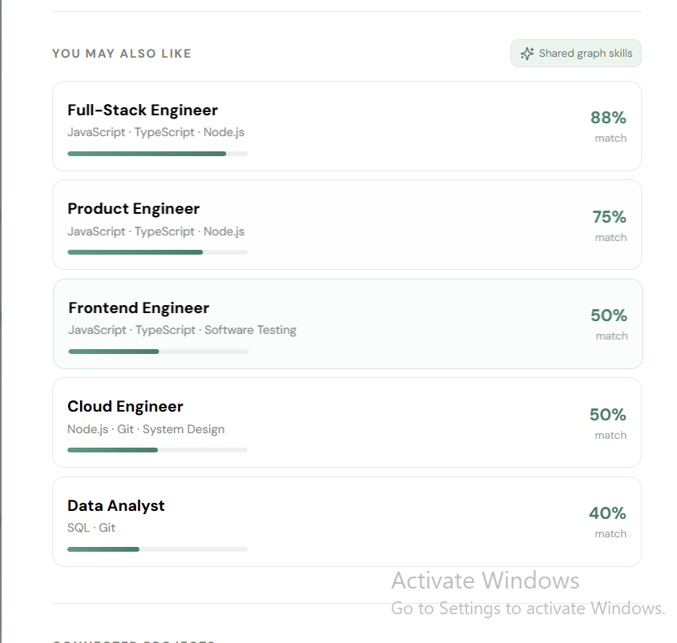

# SkillPath — Career Graph Explorer

SkillPath is a small web app that uses a graph database to explore connections between careers, skills, technologies, and projects.

The idea is simple: instead of looking at careers as separate job titles, you can open a career and see the skills connected to it, related skills, and other careers that have similar requirements.

## Why a graph database?

I chose a graph database because the main purpose of the application is exploring relationships.

For example, if someone is interested in Frontend Engineering, the application can show:

- the skills required for that career
- other skills related to those skills
- technologies used in related projects
- other careers that share similar skills

These relationships would require several joins in a relational database. With a graph database, the relationships are stored directly between the nodes, which makes these types of traversals much more natural to query with Cypher.

## Tech Stack

- React
- TypeScript
- Vite
- Express
- Neo4j JavaScript Driver
- CognoDB Cloud
- Cypher

The Neo4j JavaScript driver is used to connect to CognoDB through Bolt.

## How the graph is structured

The main nodes in the graph are:

- Career
- Skill
- Technology
- Project

The main relationships are:

- `Career -[:REQUIRES]-> Skill`
- `Career -[:USES]-> Technology`
- `Career -[:HAS_PROJECT]-> Project`
- `Career -[:RELATED_TO]-> Career`
- `Skill -[:RELATED_TO]-> Skill`
- `Project -[:BUILT_WITH]-> Technology`

A more detailed version of the model is available in [`docs/graph-model.md`](docs/graph-model.md).

## Graph model


The full graph model is also available in `docs/graph-model.md`.

## Main graph queries

### Connected skills

The application can follow:

`Career → Skill → Skill`

This is used to find skills that are connected to the skills required by a career.

### Career recommendations

The application compares careers based on their required skills. Careers with more shared skills receive a higher recommendation score.

### Projects and technologies

The graph can also follow:

`Career → Project → Technology`

This connects a career to real-world projects and the technologies used to build them.

All queries use parameters with the Neo4j driver. User input is not directly added to Cypher queries.

## Project structure

```text
skillpath/
├── client/
│   ├── src/
│   ├── index.html
│   └── vite.config.ts
├── api/
│   └── index.ts
├── cypher/
│   └── queries.cypher
├── docs/
│   ├── graph-model.md
│   ├── main page.png
│   ├── screenshot-career.png
│   └── screenshot-exploration.png
├── scripts/
│   └── seed.ts
├── src/
│   ├── db.ts
│   ├── queries.ts
│   └── server.ts
├── .env.example
├── .gitignore
├── package.json
└── README.md
```

## Setup and Run

### 1. Create a CognoDB instance

Create a free instance from the CognoDB Cloud console. Choose a region and wait for the instance to finish provisioning.

Copy the Bolt connection URI and generated password. The password should be stored securely and should not be committed to GitHub.

### 2. Configure environment variables

Create a `.env` file in the project root using `.env.example` as a template:

```env
COGNODB_URI=bolt+s://your-instance.databases.cognodb.cloud
COGNODB_USERNAME=cognodb
COGNODB_PASSWORD=your-password
PORT=3000
```

Do not commit `.env` to the repository.

### 3. Install dependencies

```
npm install
```

### 4. Load the sample graph data

```
npm run seed
```

This loads the sample careers, skills, technologies, projects, and their relationships into CognoDB.

### 5. Start the application

```
npm run dev
```

Open `http://localhost:5173` in your browser.

### Production build

```
npm run build
npm start
```

## Hosted Demo

[SkillPath — Live Demo](https://skillpath-cognodb-peach.vercel.app/)

## Screenshots

### Main Career Explorer


### Career Details



### Career Exploration



## Demo Video

[Watch the SkillPath demo](https://drive.google.com/file/d/1f5eQpxF5AUF4RLNExVv-yTECPJdCnorY/view?usp=drive_link)