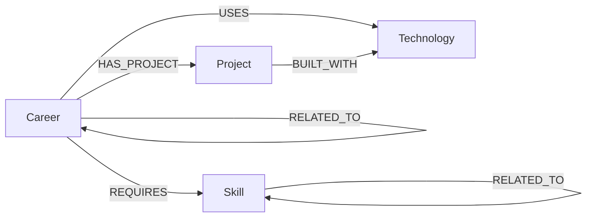

# SkillPath graph model

## Nodes
- **Career**: slug, name, description, category
- **Skill**: slug, name, category
- **Technology**: slug, name, description
- **Project**: slug, name, description

## Relationships
- `REQUIRES`: a career needs a skill
- `USES`: a career commonly uses a technology
- `HAS_PROJECT`: a representative project demonstrates the career
- `BUILT_WITH`: a project uses a technology
- `RELATED_TO`: two careers or skills have a meaningful connection
